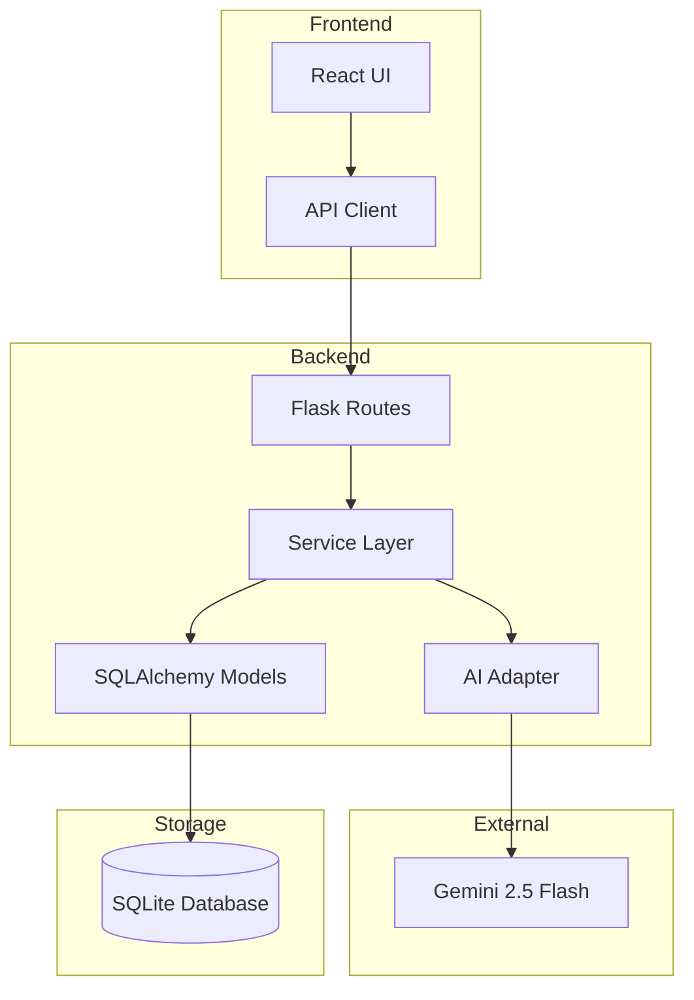

# AI StudyFlow 🎓

AI StudyFlow is a modern, full-stack application designed to take the stress out of academic planning. Using the power of **Gemini 2.5 Flash**, it generates personalized, hour-by-hour study schedules based on your subjects, deadlines, and daily study allowance.


## ✨ Features

- **🎯 AI-Powered Planning**: Generates detailed daily itineraries verified for time constraints and topic uniqueness.
- **📊 Interactive Dashboard**: Keep track of all your active study goals in a clean, card-based interface.
- **🕒 Smart Validation**: Automatically ensures no study day exceeds your preferred hours and that you finish before your deadline.
- **🗑️ Goal Management**: Easily create new goals and delete old plans when you're done.
- **🎨 Premium UI**: Minimalist dark-mode aesthetic with smooth transitions and glassmorphism elements.
- **👤 Guest Mode**: Instant access with anonymous session management—no registration required.

## 🛠️ Tech Stack

### Backend
- **Framework**: Python 3.10+ / Flask
- **Database**: SQLAlchemy (SQLite)
- **Validation**: Pydantic
- **AI Integration**: Google Generative AI (Gemini 2.5 Flash)

### Frontend
- **Library**: React 18 (Vite)
- **Routing**: React Router 6
- **Icons**: Lucide React
- **Styling**: Vanilla CSS (Modern Design System)

## 🏛️ System Architecture

The project follows a modular, layered architecture to ensure clean separation of concerns and robust AI integration:



### Key Components:
- **Service Layer**: Centrally manages business logic, ensuring AI plans strictly follow deadline and duration constraints.
- **AI Adapter**: Decouples the prompt engineering and API logic from the rest of the application.
- **Pydantic Schemas**: Enforces strict typing and structural validation for all AI-generated data before saving.
- **Session Management**: Transparent anonymous user creation logic.

## 🚀 Getting Started

### Prerequisites
- Python 3.10 or higher
- Node.js 18 or higher
- A [Gemini API Key](https://ai.google.dev/)

### Installation

1. **Clone the repository**:
   ```bash
   git clone https://github.com/yourusername/ai-study-planner.git
   cd ai-study-planner
   ```

2. **Backend Setup**:
   ```bash
   cd backend
   python -m venv venv
   source venv/bin/activate  # On Windows: venv\Scripts\activate
   pip install -r requirements.txt
   ```
   Create a `.env` file in the `backend` folder:
   ```env
   GEMINI_API_KEY=your_api_key_here
   FLASK_ENV=development
   ```

3. **Frontend Setup**:
   ```bash
   cd ../frontend
   npm install
   ```

### Running the App

1. **Start the Backend**:
   ```bash
   cd backend
   python run.py
   ```

2. **Start the Frontend**:
   ```bash
   cd frontend
   npm run dev
   ```
   Visit `http://localhost:5173` to start planning!

## 🧪 Testing

Run backend unit tests:
```bash
cd backend
python -m pytest
```

## 🎥 Demonstration

- **AI Generation**: Input your subject, set a deadline, and watch the AI carve out your path to success.
- **Dashboard**: All your plans are saved locally to your session for quick access.
- **Delete**: Clean up your workspace by removing completed goals.

---

Built with ❤️ for students who want to study smarter, not harder.
